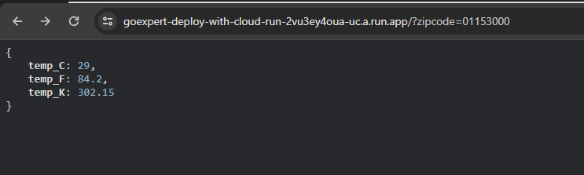

# Distributed Tracing and Span

Goexpert postgraduation project

## Lab project Description

> **Objective**: To develop a system in Go that receives a postcode, identifies the city and returns the current climate (temperature in degrees celsius, fahrenheit and kelvin). This system should be published on Google Cloud Run.
>
> ### Requirements
>
> - The system must receive a valid 8-digit postcode
> - The system must search the postcode and find the name of the location, then return the temperatures and format them in: Celsius, Fahrenheit, Kelvin.
> - The system must respond appropriately in the following scenarios:
>
>   - On success:
>     - HTTP code: 200
>     - Response Body: { "temp_C": 28.5, "temp_F": 28.5, "temp_K": 28.5 }
>   - In case of failure, if the postcode is not valid (with correct format):
>     - HTTP code: 422
>     - Message: invalid zipcode
>   - In case of failure, if the postcode is not found:
>     - HTTP code: 404
>     - Message: can't find zipcode
>
> - Deployment must be carried out in Google Cloud Run.
>
> ### Tips:
>
> - Use the viaCEP API (or similar) to find the location you want to check the temperature: https://viacep.com.br/
> - Use the WeatherAPI API (or similar) to look up the desired temperatures: https://www.weatherapi.com/
> - To convert from Celsius to Fahrenheit, use the following formula: F = C \* 1.8 + 32
> - To convert from Celsius to Kelvin, use the following formula: K = C + 273
>   - Where F = Fahrenheit
>   - Where C = Celsius
>   - Where K = Kelvin
>
> ### Delivery:
>
> - The complete source code of the implementation.
> - Automated tests demonstrating how it works.
> - Use docker/docker-compose so we can test your application.
> - Deployment carried out in Google Cloud Run (free tier) and active address to be accessed.

## How to execute

The zipcode value is taken from the `?zipcode=` query in the url.

e.g.: `http://localhost:8080/?zipcode=01153000`

### Locally (dev)

Set your WeatherAPI APIKey in the `WEATHER_API_KEY` variable in the `.env` file.

- Tests: run `make test`.
- Docker-compose: run `make dev`
- Server Port: `8080`

### Cloud Run

- Endpoint: https://goexpert-deploy-with-cloud-run-2vu3ey4oua-uc.a.run.app/
- Request e.g: https://goexpert-deploy-with-cloud-run-2vu3ey4oua-uc.a.run.app/?zipcode=29902555

